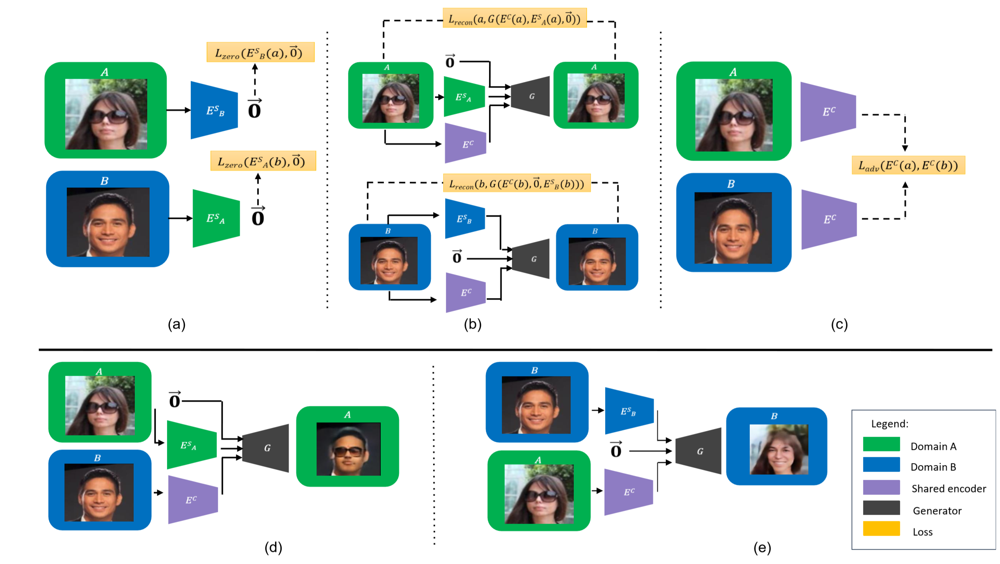

# Domain Intersectio and Domain Difference

Pytorch Implementation of "Domain Intersection and Domain Difference" (ICCV 2019)

## Prerequisites
- Python 2.7 / 3.6
- Pytorch 0.4
- [requsts](http://docs.python-requests.org/en/master/)
- [argparse](https://docs.python.org/2/howto/argparse.html)
- [Pillow](https://pillow.readthedocs.io/en/5.3.x/)

### Download and Prepare the Data
Download the celeba dataset. Create a celeb directory and place the img_align_celeba folder and list_attr_celeba.txt inside. 

You can use the provided script ```preprocess.py``` to split celebA into the above format (with A and B based on the attribute of your choosing).
For example, you can run the script using the following command:
```
python preprocess.py --root ./celeba/img_align_celeba --attributes ./celeba/list_attr_celeba.txt --dest ./smile_glasses
```
You can also use your own custom dataset, as long as it adheres to the following format:
```
root/
     trainA/
     trainB/
     testA/
     testB/
```
You can then run the preprocessing in the following manner:
```
python preprocess.py --root ./custom_dataset --dest ./custom_train --folders --config smile_glasses
```

### To Train
Run ```train.py```. You can use the following example to run:
```
python train.py --root ./smile_glasses --out ./smile_glasses_out
```

### To Resume Training
Run ```train.py```. You can use the following example to run:
```
python train.py --root ./smile_glasses --out ./smile_glasses_out --load ./smile_glasses 
```

### To Evaluate
Run ```eval.py```. You can use the following example to run:
```
python eval.py --root ./smile_glasses --out ./smile_glasses_eval --sep 25 --num_display 10
```

## Figure
Figure from paper describing the method:




## Reference
If you found this code useful, please cite the following paper:
```
@inproceedings{Benaim2019DomainIntersectionDifference,
  title={Domain Intersection and Domain Difference},
  author={Sagie Benaim and Michael Khaitov and Tomer Galanti and Lior Wolf},
  booktitle={ICCV},
  year={2019}
}
```

## Acknowledgements

The implementation is based on the architecture of [Content Disentanglement](https://github.com/oripress/ContentDisentanglement).
